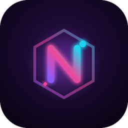

# 🧠 NEXOR IA

> Una IA **local, gratis y sin internet** que analiza registros diarios de gastos y hábitos, y actúa como **mentor semanal**: detecta patrones, propone un reto medible y le da seguimiento.


[](reportes/README.md)
[](reportes/fase-1-diagnostico-motor.md)
[](reportes/fase-3-5-evolucion-mentor.md)

---

## 📌 ¿Qué es NEXOR?

NEXOR tiene dos partes que trabajan juntas:

| Parte | Qué hace | Estado |
|---|---|:---:|
| **NEXOR REGISTER** | App Android para registrar el consumo del día a día y el dinero. | ✅ v0.1 |
| **NEXOR IA** | Mentor local: lee esos registros, encuentra patrones, propone un reto medible por semana y revisa si se cumplió. | 🟡 Beta |

La idea es simple: **primero medir, después optimizar.** NEXOR REGISTER captura los datos reales del día a día y NEXOR IA los convierte en decisiones.

---

## 📱 NEXOR REGISTER

<p align="center">
  
</p>

<p align="center"><b>Consumo y dinero, día a día</b><br>
<sub>HTML + CSS + JavaScript puro · empaquetado a APK con Capacitor · 100 % offline</sub></p>

Registra el consumo del día a día y el dinero, de forma rápida y simple. Los datos se quedan en el celular y se exportan para que NEXOR IA los analice.

📂 Código, instalación y generación del APK: [`nexor-register/`](nexor-register/README.md)

📄 Formato de los datos: [`nexor-register/docs/NEXOR_DATOS.md`](nexor-register/docs/NEXOR_DATOS.md)

---

## 🔄 Cómo funciona

```
 NEXOR REGISTER (celular)      finanzas.py (Python)             NEXOR (IA local)
 ────────────────────────      ─────────────────────────        ──────────────────────
 gastos del día        ─JSON─▶ valida los datos           ──▶  interpreta con el perfil
 cierre del día                calcula todas las cifras         y el historial
                               mide el reto anterior            explica el porqué
                               elige el foco de la semana       propone UN reto medible
                                                                        │
                                          reporte semanal (privado) ◀───┘
```

**Regla de oro: Python hace las cuentas, la IA solo interpreta.** Un modelo de 4B se equivoca al calcular, pero redacta bien cuando recibe los números ya hechos y con unidades. Detalles en la [evolución del mentor](reportes/fase-3-5-evolucion-mentor.md).

Cada exportación incluye `schema_version`, zona horaria y moneda, para que la IA entienda los datos sin adivinar.

---

## 🧭 Uso semanal

1. Exporta el JSON desde NEXOR REGISTER y cópialo en `datos/`.
2. La primera vez, copia `perfil.ejemplo.md` como `perfil.local.md` y complétalo. Así NEXOR conoce tus metas, tu horario y cómo quieres que te hable.
3. Doble clic en **`analizar_semana.bat`**. Te pregunta si cumpliste el reto anterior (`si` / `no` / `parcial`).
4. El reporte aparece en `reportes/semanas/`, con su botón en el índice de esa carpeta.

Equivalente desde la terminal:

```bash
python scripts/finanzas.py                  # usa el JSON más reciente de datos/
python scripts/finanzas.py --cumpli si      # indica si cumpliste el reto anterior
python scripts/finanzas.py --sin-ia         # solo los números, sin llamar al modelo
```

---

## 🔒 Privacidad

Todo corre en local: los datos no salen de la PC. Además, estos archivos **nunca se suben a GitHub** (están en `.gitignore`):

| Archivo | Contiene |
|---|---|
| `datos/**/*.json` | Registros exportados de la app |
| `perfil.local.md` | Perfil personal del usuario |
| `memoria/` | Historial semanal y retos |
| `reportes/semanas/` | Reportes semanales |

---

## 🤖 Motor de IA

| Herramienta | Uso |
|---|---|
| [Ollama](https://ollama.com) | Ejecuta el modelo en local y expone una API REST en `http://localhost:11434` |
| [Qwen3.5-4B](https://ollama.com/library/qwen3.5) | Modelo principal: multimodal (texto e imagen), con modo *thinking*, licencia Apache 2.0 |
| Qwen3.5-2B | Plan B, más ligero |
| Python + `requests` / `ollama` | Scripts para leer los registros y hablar con el modelo |

**Lo que puede hacer el motor:**

- 💬 Conversar en español
- 🤔 Razonar con *thinking* visible
- 🖼️ Analizar imágenes y capturas de pantalla
- 📴 Funcionar con el WiFi desconectado

### Hardware de referencia

| Componente | Equipo de prueba |
|---|---|
| GPU | NVIDIA GeForce GTX 1050 Ti · 4 GB VRAM |
| CPU | Intel Core i3 |
| RAM | 16 GB |
| Sistema | Windows 11 |

Con `num_gpu 99`, el modelo de 4B corre **100% en la GPU** a ~18 tokens/s. Sin *thinking*, una respuesta corta tarda pocos segundos.

### Instalación del motor

```powershell
# 1. Instalar Ollama (o descargar OllamaSetup.exe desde ollama.com)
irm https://ollama.com/install.ps1 | iex
ollama --version

# 2. Descargar el modelo
ollama pull qwen3.5:4b      # principal (~3,4 GB)
ollama pull qwen3.5:2b      # alternativa ligera (~2,7 GB)

# 3. Probarlo
ollama run qwen3.5:4b

# 4. Ver el modelo cargado y dónde se está ejecutando
ollama ps

# 5. Crear NEXOR (usa el Modelfile de este repo) y hablar con él sin thinking
ollama create nexor -f Modelfile
ollama run nexor --think=false
```

> 💡 En una GPU de 4 GB, Ollama deja por defecto parte del modelo en la CPU. El `Modelfile` fuerza todas las capas a la GPU (`num_gpu 99`). Detalles y mediciones en el [diagnóstico de la Fase 1](reportes/fase-1-diagnostico-motor.md).

---

## 🚦 Avance

| Fase | Descripción | Estado |
|:---:|---|:---:|
| 1 | Motor local: Ollama + Qwen3.5 funcionando en español · [diagnóstico](reportes/fase-1-diagnostico-motor.md) | ✅ Hecho |
| 2 | **NEXOR REGISTER v0.1**: app Android de registro con exportación JSON | ✅ Hecho |
| 3 | `Modelfile` de NEXOR: personalidad de mentor, reglas de datos y de seguridad · [evolución](reportes/fase-3-5-evolucion-mentor.md) | ✅ Hecho |
| 4 | Análisis semanal (`scripts/finanzas.py`): valida, calcula, elige el foco y genera el reporte | 🟡 Beta |
| 5 | Mentor con memoria: perfil + historial + reto medible que Python revisa solo | 🟡 Beta |
| 6 | Chat interactivo con el mismo contexto (`chat.py`) | ⏳ Pendiente |
| 7 | Sincronización directa entre la app y NEXOR IA, sin exportar a mano | ⏳ Futuro |

---

## 🗂️ Estructura del repositorio

```
Nexor-IA/
├── README.md               ← este archivo
├── Modelfile               ← configuración y personalidad de NEXOR
├── analizar_semana.bat     ← doble clic: genera el reporte de la semana
├── perfil.ejemplo.md       ← plantilla: cópiala como perfil.local.md (no se sube)
├── memoria/                ← historial semanal y retos (no se sube)
├── scripts/finanzas.py     ← valida el JSON, calcula el resumen y consulta a NEXOR
├── datos/                  ← JSON exportados (los reales no se suben)
├── reportes/               ← diagnósticos técnicos · semanas/ es privada (no se sube)
├── docs/img/               ← imágenes del README
└── nexor-register/         ← app Android de registro
    ├── www/                ← la app (HTML, CSS, JS)
    ├── assets/             ← ícono y pantalla de inicio
    ├── docs/NEXOR_DATOS.md ← contrato de datos para NEXOR IA
    └── android/            ← proyecto Android (Capacitor)
```


---

## ⚠️ Limitaciones conocidas

- **Puede alucinar datos:** el modelo puede inventar cifras o fechas. Por eso NEXOR trabaja sobre los registros reales y debe decir cuando falta un dato, no rellenarlo.
- **Razonamiento limitado (4B):** mezcla métricas y calcula mal si se le pide hacer cuentas. Por eso recibe cifras ya calculadas, responde con un esquema JSON fijo y elige retos de una lista.
- **Contexto limitado:** conviene analizar por semanas, no meses enteros de una sola vez.
- **Registro manual:** la calidad del análisis depende de registrar todos los días.

---

## 📜 Licencias

- El modelo **Qwen3.5** se distribuye con licencia **Apache 2.0**. Este repositorio no incluye el modelo, solo enlaza a [Ollama](https://ollama.com/library/qwen3.5).
- Licencia del código de este repositorio: *por definir*.

---

## 👤 Autor

**Anthony**

<p align="center"><i>Última actualización: 30 de septiembre de 2026</i></p>
